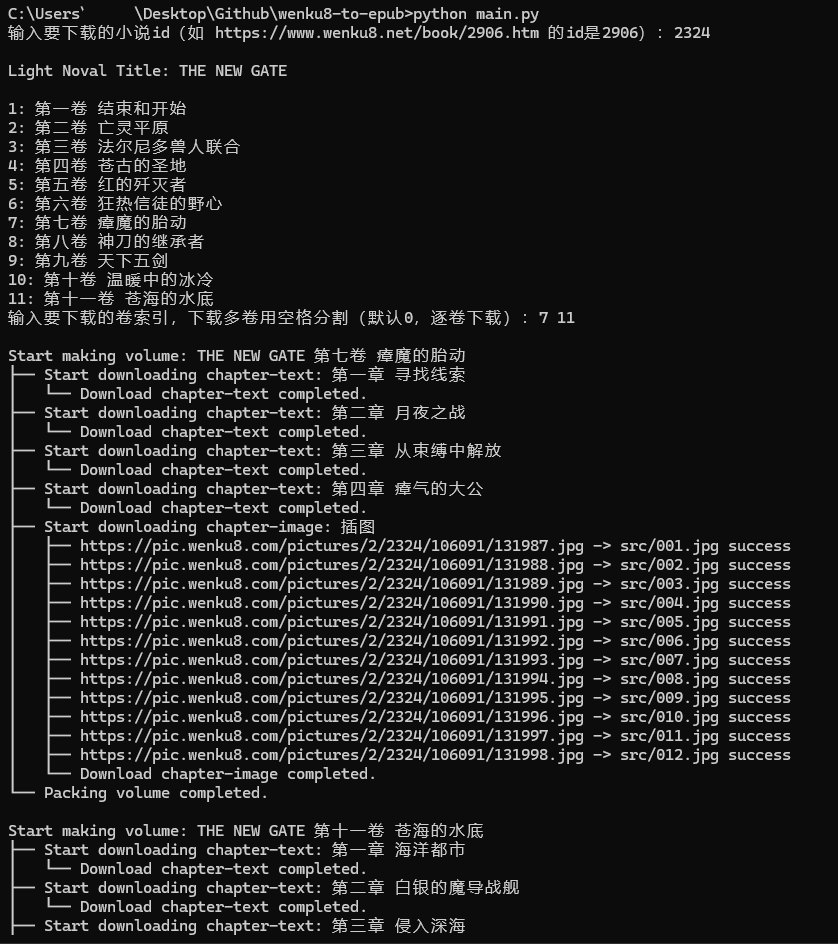

# wenku8-epub

[轻小说文库](https://www.wenku8.net)在线小说转epub


## 项目简介

### 1. 功能

- **按卷下载**、**指定卷下载**小说各章节（含插图页）并封装至epub，并且通过了carlibre检测，没有错误信息
- 支持填充小说元数据（标题、作者、介绍、出版商、标签、封面）
  - 支持[calibre](https://github.com/kovidgoyal/calibre)自有元数据（丛书series、丛书编号series_index）
- 支持小说目录自动生成

> 所有数据源自[轻小说文库](https://www.wenku8.net/)。

### 2. 功能演示



## 如何使用

在运行前需要安装依赖包：

```python
pip install -r requirements
```

请确保工作目录是项目根目录，然后在终端输入以下指令：

```python
python main.py
```

输入要下载的book_id，等待下载结束，epub默认保存在`epub`文件夹下。


**可调参数**（在`main.py`文件内）

| 参数名                   | 默认值 | 作用描述                                                     |
| :----------------------- | ------ | ------------------------------------------------------------ |
| `save_epub_dir`          | `epub` | epub存储目录（相对路径/绝对路径）                            |
| `sleep_time`             | `2`    | 每次网络请求后停顿时间，避免封IP                             |
| `use_divimage_set_cover` | `True` | 是否将插图第一张长图设为封面，若不设置就默认使用小说详情页封面 |
| `wenkupic_proxy_host`    | `None` | 反代pic.wenku8.com的host：xxxx.xxxx.workers.dev 或 自定义域名 |

> 目前wenkupic_proxy_host设置为作者反代域名`wk8-test.jsone.gq`，仅供测试，不保证长期有效性。


## 常见问题

### 1. 插图下载失败

出现`requests.exceptions.SSLError: HTTPSConnectionPool(host='pic.wenku8.com', port=443)`

**原因：**可能是本地网络环境问题。

**解决：**

使用cloudflare workers反代`pic.wenku8.com`。

- 新建一个cloudflare workers；
- 部署。编辑代码，将下面代码粘贴进去后部署；

```js
const host = "pic.wenku8.com";
addEventListener('fetch', event => {
    event.respondWith(handleRequest(event.request))
})
async function handleRequest(request) {
    var u = new URL(request.url);
    u.host = host;
    var req = new Request(u, {
        method: request.method,
        headers: request.headers,
        body: request.body
    });
    const result = await fetch(req);
    return result;
}
```

- 将反代的网址粘贴到  main.py的 wenkupic_proxy_host变量处，如`wenkupic_proxy_host = xxxx.xxxxx.workers.dev`

### 2. Access denied

出现`Access denied | www.wenku8.net used Cloudflare to restrict access`。

**原因：**访问过于频繁，请求受限。

**解决：**增加请求延迟，自定义参数增加`sleep_time`的值。


## 其他说明

- 同一系列的不同卷用的还是同一组元数据，所以目前有书名/封面区分各卷。
  > 不同卷一般有两个元数据需要变动：封面和介绍。 <br>
  > 封面：默认使用插图的第一张长图（如果有，没有就使用详情页的缩略图），可以通过修改`main.py`的`use_divimage_set_cover`关闭。<br>
  > 介绍：目测wenku8只有详情页有，其他分卷没有，所以目前同一系列的不同卷用的是一个介绍。
- 目测轻小说文库的小说目录只有两级`卷 -> 章`，所以分卷下载时不考虑分级（卷内全都是一级目录）。


